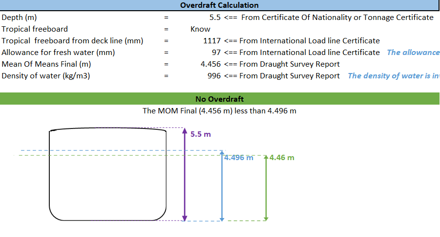
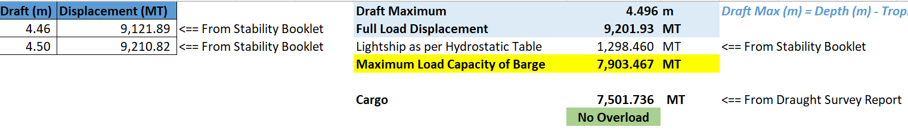

## Barge Overload & Overdraft Assessment Calculator

## Overview

The **Barge Overload & Overdraft Assessment Calculator** is a Microsoft Excel-based engineering tool developed to determine whether a barge complies with overload and overdraft requirements before departure.

The calculator uses hydrostatic data, draft survey measurements, freeboard information, and water density to evaluate loading conditions and automatically determine whether the barge satisfies the **No Overload / No Overdraft Warranty** commonly applied in marine cargo insurance.

---

## Objectives

This project was developed to:

- Determine whether a barge is overloaded before departure.
- Determine whether a barge is in an overdraft condition.
- Support marine surveyors during loading operations.
- Assist marine insurers in verifying compliance with policy warranties.
- Improve accuracy and reduce manual calculations.

---

## Key Features

- Automatic Overload calculation
- Automatic Overdraft calculation
- Maximum cargo capacity calculation
- Maximum allowable draft calculation
- Hydrostatic interpolation
- Draft survey verification
- Water density correction
- Automatic result indication:
  - No Overload / Overload
  - No Overdraft / Overdraft

---

## Methodology

The calculator follows these engineering principles:

1. Determine the maximum allowable draft based on:
   - Vessel depth
   - Tropical freeboard
   - Fresh water allowance

2. Interpolate hydrostatic data to obtain:
   - Full load displacement

3. Calculate:

Maximum Load Capacity = Full Load Displacement − Lightship

4. Compare:

Cargo Weight vs Maximum Load Capacity

5. Compare:

Mean of Means Final vs Maximum Allowable Draft

6. Display:

- No Overload / Overload
- No Overdraft / Overdraft
  
---

## Calculation Inputs

The workbook requires the following information:

- Vessel depth
- Tropical freeboard
- Fresh water allowance
- Mean of Means Final (Draft Survey)
- Water density
- Hydrostatic table
- Lightship displacement
- Cargo weight

---

## How to Use

1. Open the Excel workbook.
2. Enter the vessel particulars.
3. Input hydrostatic table values.
4. Enter draft survey measurements.
5. Input freeboard information.
6. Input water density.
7. Review the automatically calculated results.

The workbook will determine:

- Maximum allowable draft
- Maximum cargo capacity
- Overload status
- Overdraft status

---

## Benefits

This calculator helps:

- Marine Surveyors
- Marine Cargo Adjusters
- Marine Insurance Professionals
- Cargo Owners
- Ship Operators

by providing:

- Faster calculations
- Reduced human error
- Consistent engineering calculations
- Better loading verification
- Support for marine insurance investigations
- Verification of compliance with No Overload / No Overdraft Warranty

---

## Technologies Used

- Microsoft Excel
- Engineering Calculations
- Hydrostatic Data
- Draft Survey Principles

---

## Screenshots

### Overdraft Assessment

---

### Overload Assessment

---

## Disclaimer

This workbook is intended for educational and professional demonstration purposes.

Any confidential company information, vessel particulars, client data, or insurance information has been removed or anonymized before publication.

---

## Author

**Ahmad Subari**

Marine Cargo Surveyor & Adjuster

LinkedIn:
www.linkedin.com/in/ahmadsubari23

GitHub:
https://github.com/ahmadsubari23

Email:
ahmad.subari23@gmail.com
